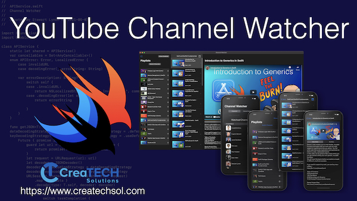

# YouTube Channel Watcher

An open source project build using SwiftUI and Combine that lets you monitor a variety of different YouTube channels and their corresoinding playlists.  Play the videos inline within the app on an iPhone, iPad or Macintosh.

You will need to scure your own YouTube Google API to run the project.  Please watch the video linked below for more detailed information on how to do this.

## How to Proceed

The video will show you in detail how to complete the necessary tasks, but if you prefer, here is the TLDR;

1. Change the BundleID on the app to match your own domain
2. Go to https://developers.google.com/youtube/v3/getting-started and make sure you sign in with your Google Account.  Follow the instructions as outlined below to  create a project, request an API key and register your application

3. Create a new project in the Google Developers Console
4. Selecte the project from the dropdown and Enable APIs and services - Selected YouTube Data API v4

3. Click on credentials
4. Select Create Credentials and select API Key
5. Your API key will be provided.  You can copy it from here or later. 

#### API Restrictions

You can follow the Google API recommendations if you wish to restrict access to your API key.

